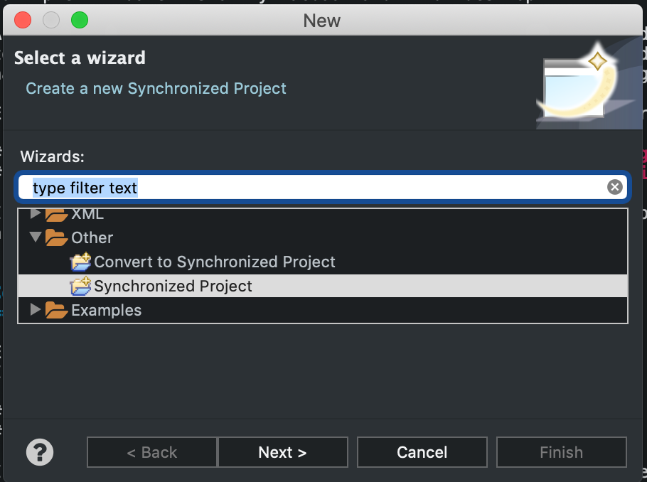
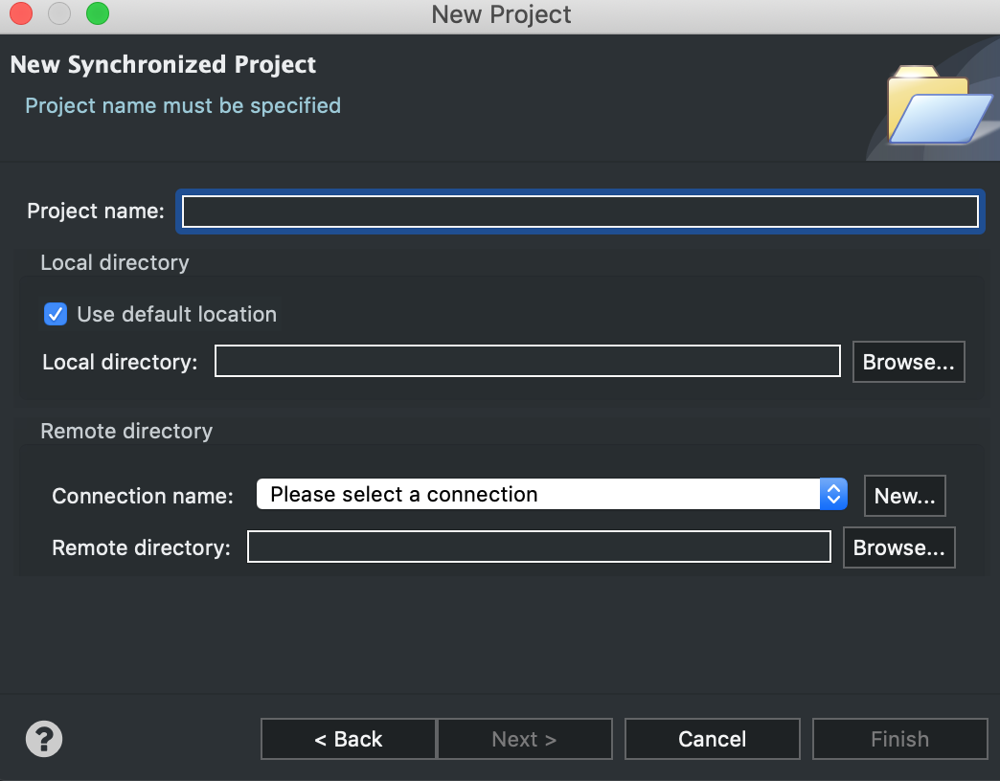
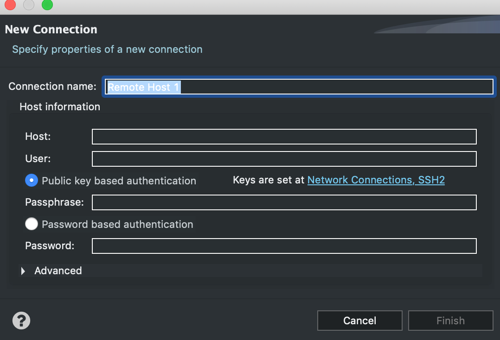
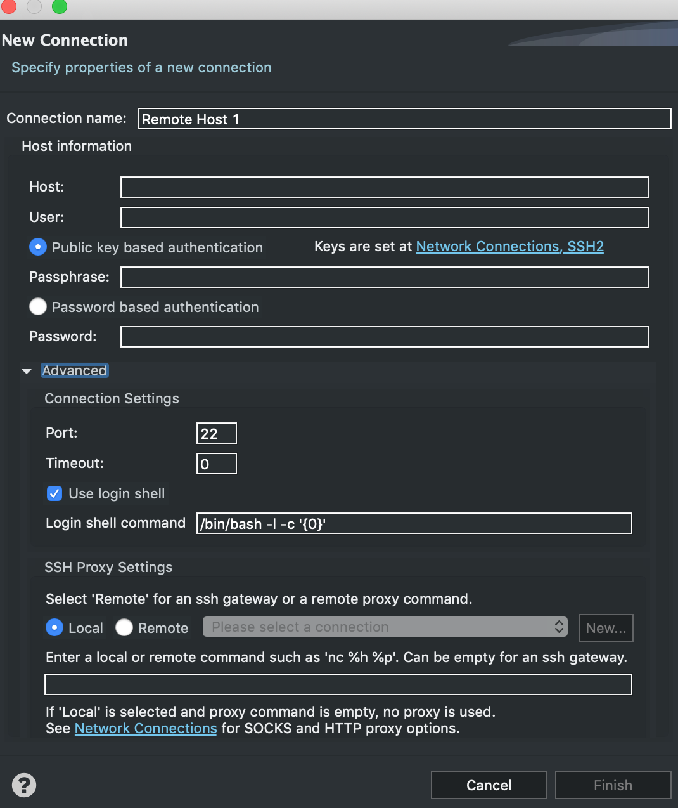
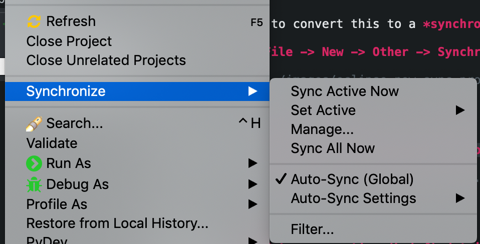
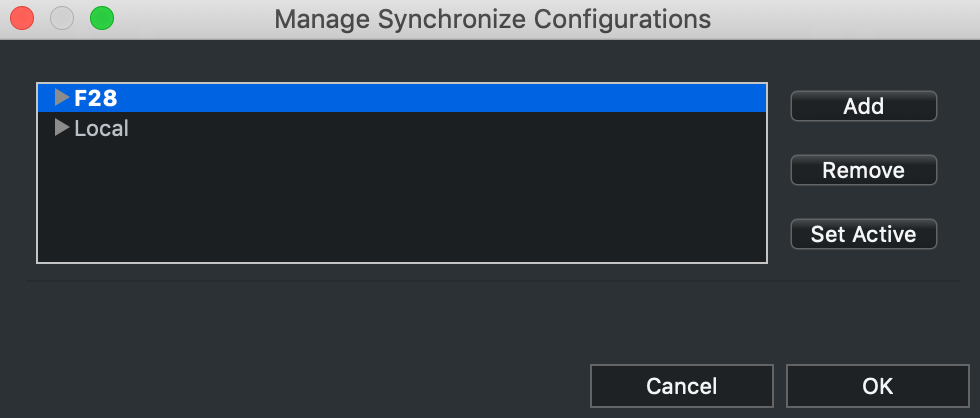

:github_url: https://github.com/sjfke/nonbleedingedge/blob/master/retired/eclipse-remote-dev.rst

**************************
Eclipse Remote Development
**************************

Introduction
============

This HOWTO explains how to setup Eclipse for development and debugging on remote servers 
or virtual machines.

This functionality exists with `PyCharm professional <https://www.jetbrains.com/pycharm/>`_, I was looking for ability to use a 
virtual machine for Python development with Eclipse, rather than force everything through 
muiltple virtualenv's on my Macbook and Linux desktop. 

Although well hidden one of the prebuilt Eclipse packages provides the functionality 
to do this, but only for C/C++, so after installing the required package, you will
have to add the Eclipse plugin(s) to handle your desired language and SCM.

Eclipse recently renamed the PDT package so you should use (1) rather than (2), I am currently using (2).

#. `Eclipse IDE for Scientific Computing <http://www.eclipse.org/downloads/packages/release/2018-09/r/eclipse-ide-scientific-computing>`_
#. `Eclipse for Parallel Application Developers <http://www.eclipse.org/downloads/packages/release/oxygen/3/eclipse-parallel-application-developers>`_

I suggest you search with Eclipse Marketplace for your plugin, only download and manually install if 
all else fails.

Color Themes
============

Eclipse, default color theme *kinda* sucks unless want to stare at a large white screen all day long! :-D
I would strong suggest you install either of:

#. `DevStyle <https://www.genuitec.com/products/devstyle/>`_
#. `Eclipse Color Themes <http://www.eclipsecolorthemes.org/>`_

If you recently switched to macOS Mojave and are using Dark mode, use *DevStyle*, otherwise choose a color 
theme that works best for you, but note some eclipse plugins don't work well with certain color themes and 
the color theme only applies to the editor tabs (unlike DevStyle).

Language Plugin
===============

Now unless you are fortunate and plan to use ``C/C++`` you'll need to install your desired language and SCM plugins. 

* `PyDev - Python IDE for Eclipse <https://marketplace.eclipse.org/content/pydev-python-ide-eclipse>`_
* `EPIC Eclipse Perl Integration <https://marketplace.eclipse.org/content/epic-eclipse-perl-integration>`_
* `PHP Development Tools <https://marketplace.eclipse.org/content/php-development-tools>`_
* `Ruby DLTK <https://marketplace.eclipse.org/content/ruby-dltk>`_
* `Node.JS Nodeclipse <https://marketplace.eclipse.org/content/nodeclipse>`_
* `Eclipse Java Development Tools <https://marketplace.eclipse.org/content/eclipse-java-development-tools-0>`_
* `EGit - Git Integration for Eclipse <https://marketplace.eclipse.org/content/egit-git-integration-eclipse>`_
* `Subversive - SVN Team Provider <https://marketplace.eclipse.org/content/subversive-svn-team-provider>`_
* `SSH Agent Integration for Eclipse <https://marketplace.eclipse.org/content/ssh-agent-integration-eclipse>`_

Synchronized projects
=====================

After installing ``Eclipse`` and your required plugins, now let's create and setup your synchonized project.

Create your synchronized project
--------------------------------

Assuming your project already exists on ``github`` ::

	$ cd <workspace>
	$ git clone <git-url> # git@github.com:<git-user>/<project>.git
	$ cd <project>
	$ git checkout -b twig-branch
	
	<workspace>:
	$HOME/workspace # default     # Linux
	$HOME/eclipse-workspace       # macOS, if Eclipse was installed using _brew_
	C:\Users\%USERNAME%\workspace # Windows
	
	
Now we need to convert this to a *synchronized project*, so

:Eclipse: *File -> New -> Other -> Synchronized Project*

  
:Eclipse: *Enter project and select new or existing connection name*

    
:Eclipse: *Enter connection (brief) details*

:Eclipse: *Enter connection (full) details*
    

    
Manage your synchronized project
--------------------------------

:Eclipse: *<project> - right mouse click*
    

:Eclipse: *Manage connections dialogue*

Now updates in ``Eclipse`` should be automatically synchronized to the remote server 
in the specified top level directory.

I prefer to work in a remote terminal outside of Eclipse, but it should be able to configure 
the Eclispe run-time to execute everything on the remote host, but that is *left as an exercise for the reader* 
